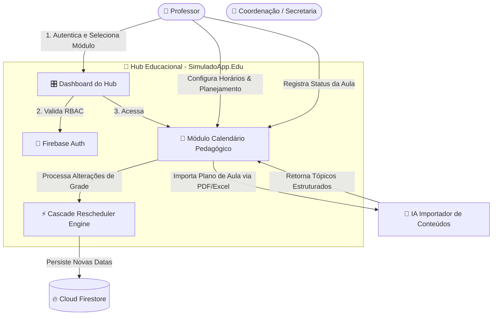
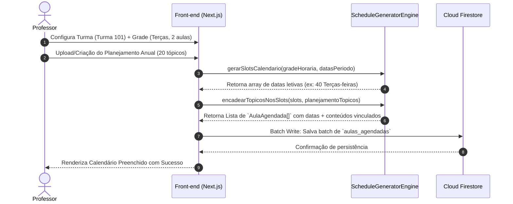
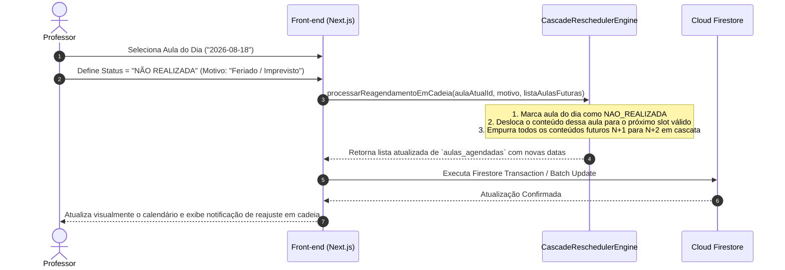

# 🏗️ Arquitetura do Módulo: Calendário Pedagógico & Planejamento Inteligente de Aulas

Esta especificação arquitetural projeta o novo módulo de **Calendário Pedagógico & Planejamento Inteligente** integrado ao **Hub Educacional Unificado (SimuladoApp.Edu)**.

---

## 1. Visão Geral

O módulo de **Calendário Pedagógico** resolve a complexidade da gestão temporal e cumprimento do currículo escolar para professores do Ensino Fundamental e Médio. Ele automatiza a criação do calendário de aulas a partir da grade horária da turma, realiza o encadeamento inteligente dos tópicos do planejamento anual/bimestral e executa o **reagendamento automático em cadeia** (Cascade Rescheduling) quando ocorrem imprevistos, feriados, faltas ou conteúdos ministrados parcialmente.

O sistema integra-se ao ecossistema existente (Next.js 14, Firebase Auth, Cloud Firestore) como um módulo nativo do Hub Educacional, permitindo exportação/importação de planejamentos em lote, controle visual de execução de aulas e registro auditável de justificativas de não-realização.

---

## 2. Requisitos Arquiteturais

| Requisito | Tipo | Prioridade | Notas |
| :--- | :--- | :--- | :--- |
| **Geração de Grade de Aulas (Recorrência)** | Funcional | 🔴 Alta | Suporte a horários semanais fixos (ex: Terças, 2 aulas geminadas) gerando datas letivas |
| **Importação & Sequenciamento de Conteúdos** | Funcional | 🔴 Alta | Importação de planilha/PDF ou criação manual de tópicos mapeados para a grade |
| **Algoritmo de Reagendamento em Cadeia** | Funcional | 🔴 Alta | Empurrar aulas subsequentes em cascata ao marcar status *Parcial* ou *Não Realizada* |
| **Justificativa Auditável de Imprevistos** | Funcional | 🟡 Média | Registro obrigatório de motivo ao cancelar/adiar aula |
| **Reatividade & Sincronização offline-first** | Não-Funcional | 🟡 Média | Suporte a chamadas rápidas e persistência local via Firestore SDK |
| **Latência de Reordenamento < 100ms** | Não-Funcional | 🔴 Alta | Recomputação rápida da cadeia de aulas no cliente / Cloud Function |
| **Integração ao RBAC do Hub Educacional** | Não-Funcional | 🔴 Alta | Acesso restrito via `modulos_permitidos: ["calendario-pedagogico"]` |

---

## 3. Estilo Arquitetural Recomendado

Adotamos a **Arquitetura Modular em Camadas (Domain-Driven UI/Services)** dentro da estrutura existente do Next.js (App Router), separando estritamente:

1. **Camada de Apresentação (React Server & Client Components)**: Visão semanal/mensal de calendário, modal de status de aula, wizard de importação de plano anual.
2. **Camada de Domínio / Regras de Negócio (Engine Domain)**: Motor puro de cálculo de datas (Date Math Engine) e Algoritmo de Reagendamento em Cascata (*Cascade Rescheduler*).
3. **Camada de Infraestrutura / Persistência**: Repositórios Firestore desacoplados via interfaces TypeScript.

```
┌────────────────────────────────────────────────────────────────────────┐
│                        HUB EDUCACIONAL (Next.js)                       │
├────────────────────────────────────────────────────────────────────────┤
│ 🟢 Frontend (React / Tailwind / FullCalendar / Lucide)                 │
│    ├── /diario/calendario (Página Principal Módulo)                   │
│    ├── /components/calendario (Grid, CardAula, ModalJustificativa)     │
│    └── /hooks/useCalendarioPedagogico.ts                               │
├────────────────────────────────────────────────────────────────────────┤
│ 🔵 Core Domain & Engines (TypeScript Pure Functions)                  │
│    ├── ScheduleGeneratorEngine.ts (Gera slots recorrentes)             │
│    ├── CascadeReschedulerEngine.ts (Empurra/reorganiza conteúdo)      │
│    └── PlanningImporterEngine.ts (Parseia planilhas/documentos)       │
├────────────────────────────────────────────────────────────────────────┤
│ 🔴 Storage Layer (Firebase Firestore)                                  │
│    ├── collection('turmas/{turmaId}/horarios_semanais')                │
│    ├── collection('planejamentos/{planejamentoId}')                   │
│    └── collection('aulas_agendadas/{aulaId}')                          │
└────────────────────────────────────────────────────────────────────────┘
```

---

## 4. Diagrama de Contexto (System Context)



---

## 5. Modelo de Dados (Firestore Schema)

```typescript
// 1. Definição da Grade Horária Semanal da Turma
// Collection: turmas/{turmaId}/grade_horaria
interface GradeHorariaSemanal {
  id: string;
  turmaId: string;
  turmaNome: string; // Ex: "Turma 101"
  disciplina: string; // Ex: "História"
  diasSemana: Array<{
    diaSemana: 0 | 1 | 2 | 3 | 4 | 5 | 6; // 2 = Terça-feira
    horarioInicio: string; // "07:30"
    horarioFim: string; // "09:10"
    quantidadeAulas: number; // Ex: 2 aulas geminadas
  }>;
  dataInicioPeriodo: string; // "2026-02-01"
  dataFimPeriodo: string; // "2026-12-15"
}

// 2. Unidade de Planejamento Anual / Bimestral
// Collection: planejamentos/{planejamentoId}
interface PlanejamentoAnual {
  id: string;
  professorId: string;
  disciplina: string;
  anoLetivo: number;
  topicos: Array<{
    ordem: number;
    titulo: string; // Ex: "Revolução Industrial: Causas e Impactos"
    descricao?: string;
    duracaoEstimadaAulas: number; // Ex: 2 (corresponde a 2 slots de aula)
    objetivosBNCC?: string[];
  }>;
}

// 3. Slot Concreto de Aula Agendada no Calendário
// Collection: aulas_agendadas/{aulaId}
interface AulaAgendada {
  id: string;
  professorId: string;
  turmaId: string;
  planejamentoId: string;
  dataAgendada: string; // "2026-08-18" (ISO YYYY-MM-DD)
  diaSemana: number;
  horarioInicio: string;
  horarioFim: string;
  
  // Tópico planejado vinculado
  topicoOrdem: number;
  topicoTitulo: string;
  duracaoAlocadaAulas: number;

  // Status de Execução
  status: 'AGENDADA' | 'CONCLUIDA' | 'PARCIAL' | 'NAO_REALIZADA';
  
  // Detalhes da Execução (quando preenchido pelo professor)
  execucao?: {
    dataRegistro: string;
    observacaoJustificativa?: string; // Ex: "Feriado Municipal" ou "Reunião de Pais"
    percentualConcluido?: number; // Ex: 50% em caso de status PARCIAL
    reagendadoParaData?: string; // Data para onde a pendência foi empurrada
  };

  ordemSequencialIndex: number; // Para facilitar ordenação e encadeamento em cascata
}
```

---

## 6. Fluxos Críticos & Sequence Diagrams

### 6.1. Geração Automática da Grade & Encademento do Planejamento



---

### 6.2. Motor de Reagendamento em Cadeia (Cascade Rescheduling Engine)

Este é o fluxo vital do sistema quando uma aula é marcada como **PARCIAL** ou **NÃO REALIZADA**.



---

## 7. Regra do Algoritmo de Reagendamento (Cascade Engine Pseudocode)

```typescript
export function recalcularCadeiaAulas(
  aulas: AulaAgendada[],
  aulaModificadaId: string,
  novoStatus: 'CONCLUIDA' | 'PARCIAL' | 'NAO_REALIZADA',
  motivoJustificativa?: string,
  percentualConcluido: number = 100
): AulaAgendada[] {
  const indexModificado = aulas.findIndex(a => a.id === aulaModificadaId);
  if (indexModificado === -1) return aulas;

  const resultado = [...aulas];
  const aulaAtual = { ...resultado[indexModificado] };

  if (novoStatus === 'NAO_REALIZADA') {
    aulaAtual.status = 'NAO_REALIZADA';
    aulaAtual.execucao = {
      dataRegistro: new Date().toISOString(),
      observacaoJustificativa: motivoJustificativa || 'Aula não realizada'
    };

    // O conteúdo da aula atual precisa ir para o slot futuro (indexModificado + 1)
    // E todos os conteúdos subsequentes avançam 1 posição na grade de datas
    let conteudoEmpurrado = {
      topicoOrdem: aulaAtual.topicoOrdem,
      topicoTitulo: aulaAtual.topicoTitulo,
      duracaoAlocadaAulas: aulaAtual.duracaoAlocadaAulas
    };

    for (let i = indexModificado + 1; i < resultado.length; i++) {
      const conteudoOriginalDoSlot = {
        topicoOrdem: resultado[i].topicoOrdem,
        topicoTitulo: resultado[i].topicoTitulo,
        duracaoAlocadaAulas: resultado[i].duracaoAlocadaAulas
      };

      // Substitui conteúdo do slot atual pelo conteúdo empurrado
      resultado[i] = {
        ...resultado[i],
        topicoOrdem: conteudoEmpurrado.topicoOrdem,
        topicoTitulo: conteudoEmpurrado.topicoTitulo,
        duracaoAlocadaAulas: conteudoEmpurrado.duracaoAlocadaAulas
      };

      // O conteúdo antigo deste slot passa a ser o novo conteúdo empurrado para o próximo slot
      conteudoEmpurrado = conteudoOriginalDoSlot;
    }
  } else if (novoStatus === 'PARCIAL') {
    aulaAtual.status = 'PARCIAL';
    aulaAtual.execucao = {
      dataRegistro: new Date().toISOString(),
      observacaoJustificativa: motivoJustificativa,
      percentualConcluido
    };
    // Parte remanescente é agendada como continuação no próximo slot letivo
  } else {
    aulaAtual.status = 'CONCLUIDA';
    aulaAtual.execucao = { dataRegistro: new Date().toISOString() };
  }

  resultado[indexModificado] = aulaAtual;
  return resultado;
}
```

---

## 8. Decisões de Tecnologia

| Camada | Tecnologia | Motivo |
| :--- | :--- | :--- |
| **Componentes de Calendário** | `@fullcalendar/react` / Tailwind Grid | Renderização fluida de visualização diária, semanal e mensal |
| **Processamento Local** | Native JS Date Math + `date-fns` | Cálculos rápidos de recorrência e feriados sem dependência de servidor |
| **Banco de Dados** | Cloud Firestore | Modelagem orientada a collections de turmas, com realtime listeners para turmas compartilhadas |
| **IA / Importação** | Gemini API (`firebase_ai_logic_basics`) | Extração estruturada de temas/tópicos de planejamentos em PDF/Word/Excel colados |

---

## 9. Riscos e Mitigações

| Risco | Impacto | Mitigação |
| :--- | :--- | :--- |
| **Estouro de slots no final do ano letivo** ao empurrar muitas aulas | 🟡 Médio | O algoritmo detecta se o conteúdo ultrapassar a última data letiva e alerta: *"Atenção: 2 tópicos do planejamento excederam o final do ano letivo. Deseja adicionar aulas extras?"* |
| **Feriados Nacionais/Escolares não contabilizados** | 🔴 Alto | Integração com tabela de feriados nacionais + permissão para o professor cadastrar "Dias Sem Aula" na escola |
| **Edição simultânea de calendário por múltiplos professores da mesma turma** | 🟡 Médio | Isolamento por Disciplina + Firestore Transactions para evitar condições de corrida |

---

## 10. Roadmap de Implementação

### Fase 1 — MVP & Cadastro de Grade (Semanas 1-2)
- [x] Especificação da Arquitetura e SDD.
- [ ] Cadastro da Grade Horária Semanal por Turma (ex: Terças-feiras, 2 aulas).
- [ ] Visualização de Calendário Semanal/Mensal com slots gerados.

### Fase 2 — Encadeamento de Planejamento & Execução (Semanas 3-4)
- [ ] Wizard de criação/importação de Planejamento Anual (Tópicos de Aulas).
- [ ] Mapeamento sequencial Tópico → Slot de Aula.
- [ ] Modal de Marcação de Status (Concluída, Parcial, Não Realizada) com justificativa.

### Fase 3 — Engine de Reagendamento em Cadeia & IA (Semanas 5-6)
- [ ] Implementação do `CascadeReschedulerEngine` (reordenamento automático em massa).
- [ ] Suporte a Feriados e Recesso Escolar no cálculo de recorrência.
- [ ] Importador de Planejamento via IA (PDF/Excel para Tópicos Estruturados).
