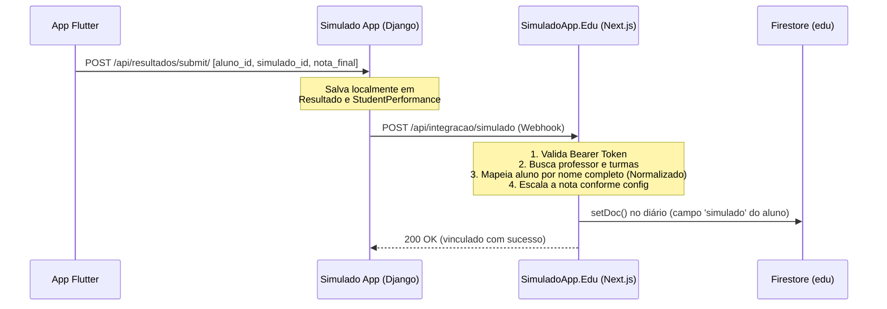

# Spec/Design Document (SDD) — Arquitetura de Integração de Simulados

Este documento detalha o design técnico, esquemas de dados, endpoints e fluxo de execução para a integração de notas de simulados entre o **Simulado App** (Django) e o **SimuladoApp.Edu** (Next.js/Firestore).

---

## 1. Fluxo de Integração (Sequence Diagram)

O diagrama abaixo ilustra o fluxo de dados desde o aplicativo mobile (Flutter) até a atualização final do Diário Pedagógico no Firestore.



---

## 2. Especificação do Payload (Webhook)

### Request (Django -> Next.js)
*   **Método:** `POST`
*   **Endpoint:** `https://edu.simuladoapp.com.br/api/integracao/simulado` (URL parametrizável por ambiente)
*   **Headers:**
    ```http
    Content-Type: application/json
    Authorization: Bearer <SHARED_INTEGRATION_KEY>
    ```
*   **Corpo da Requisição (JSON):**
    ```json
    {
      "aluno_nome": "JOAO SILVA MENDES",
      "aluno_email": "joao.silva@escola.com",
      "simulado_id": "98231",
      "simulado_titulo": "Simulado 1º Bimestre - Matemática",
      "bimestre": 1,
      "pontuacao_porcentagem": 80.0,
      "professor_email": "joana.professora@escola.com",
      "professor_uid": "prof_abc123"
    }
    ```

---

## 3. Implementação Técnica

### A. Lado Simulado App (Django - Python)

No Django, no arquivo `api/views.py` (ou em um `post_save` signal do model `Resultado` em `api/models.py`), deve ser disparada a requisição HTTP. 

Recomenda-se disparar de forma **assíncrona** usando `threading` ou uma fila de tarefas (como Celery) para não bloquear o aplicativo móvel do aluno durante a resposta da submissão do cartão-resposta.

#### Exemplo de Envio em Python (`api/utils.py` ou `views.py`):
```python
import json
import requests
import threading
from django.conf import settings

def enviar_webhook_diario_async(resultado_obj):
    # Executa em uma thread separada para não travar o cliente móvel
    thread = threading.Thread(target=enviar_webhook_diario, args=(resultado_obj,))
    thread.daemon = True
    thread.start()

def enviar_webhook_diario(resultado):
    # URL de integração e Token configurados no settings/env do Django
    url = getattr(settings, "DIARIO_INTEGRATION_URL", "https://edu.simuladoapp.com.br/api/integracao/simulado")
    token = getattr(settings, "DIARIO_INTEGRATION_TOKEN", None)
    
    if not token:
        print("Integração desativada: DIARIO_INTEGRATION_TOKEN não configurado no .env.")
        return

    # O campo resultado.pontuacao representa o percentual de acerto (de 0 a 100)
    payload = {
        "aluno_nome": resultado.aluno.name.upper().strip(),
        "aluno_email": resultado.aluno.email,
        "simulado_id": str(resultado.simulado.id),
        "simulado_titulo": resultado.simulado.titulo,
        "bimestre": int(resultado.tipo_prova) if (resultado.tipo_prova and resultado.tipo_prova.isdigit()) else 1,
        "pontuacao_porcentagem": float(resultado.pontuacao),
        "professor_email": resultado.aluno.user.email,
        "professor_uid": resultado.aluno.user.username  # Certifique-se de que o UID/Username do professor seja igual ao UID no Firebase do SimuladoApp.Edu
    }

    headers = {
        "Content-Type": "application/json",
        "Authorization": f"Bearer {token}"
    }

    try:
        response = requests.post(url, json=payload, headers=headers, timeout=5)
        if response.status_code == 200:
            print(f"Webhook enviado com sucesso para {resultado.aluno.name}")
        else:
            print(f"Falha ao enviar Webhook: {response.status_code} - {response.text}")
    except Exception as e:
        print(f"Erro na conexão do Webhook de Notas: {str(e)}")
```

*Nota: Para acionar a integração, basta chamar `enviar_webhook_diario_async(resultado)` ao final da função `submit_resultado` em `api/views.py` após o salvamento no banco de dados.*

---

### B. Lado SimuladoApp.Edu (Next.js - JavaScript)

Abaixo está o código-fonte sugerido para a rota de API do Next.js (App Router) em `frontend/src/app/api/integracao/simulado/route.js`. Ela manipula o diário do professor no Firestore e as notas individuais do portal do aluno de forma atômica.

#### Código da Rota de API (`frontend/src/app/api/integracao/simulado/route.js`):
```javascript
import { NextResponse } from 'next/server';
import { db } from '@/lib/firebase';
import { doc, getDoc, setDoc, serverTimestamp } from 'firebase/firestore';

export async function POST(request) {
  try {
    const authHeader = request.headers.get('authorization');
    const token = authHeader?.split(' ')[1];
    
    // 1. Validar Token de Segurança da Variável de Ambiente
    if (!token || token !== process.env.SHARED_INTEGRATION_KEY) {
      return NextResponse.json({ error: 'Não autorizado.' }, { status: 401 });
    }

    const data = await request.json();
    const {
      aluno_nome,
      bimestre,
      pontuacao_porcentagem,
      professor_uid
    } = data;

    if (!aluno_nome || !professor_uid) {
      return NextResponse.json({ error: 'Dados obrigatórios ausentes.' }, { status: 400 });
    }

    // 2. Localizar o Diário do Professor
    const refSub = doc(db, 'professores', professor_uid, 'turmas', 'data');
    const snapSub = await getDoc(refSub);
    
    if (!snapSub.exists()) {
      return NextResponse.json({ error: 'Professor ou diário não encontrado.' }, { status: 404 });
    }

    const turmasData = snapSub.data().turmas || [];
    let turmaAlvo = null;
    let alunoAlvo = null;

    // 3. Mapear Aluno por Comparação de Nome
    const cleanStr = (s) => s.normalize("NFD").replace(/[\u0300-\u036f]/g, "").trim().toLowerCase();
    const targetNome = cleanStr(aluno_nome);

    for (const t of turmasData) {
      const found = t.alunos?.find(al => cleanStr(al.nome) === targetNome);
      if (found) {
        turmaAlvo = t;
        alunoAlvo = found;
        break;
      }
    }

    if (!turmaAlvo || !alunoAlvo) {
      return NextResponse.json({ error: `Aluno ${aluno_nome} não localizado nas turmas do professor.` }, { status: 404 });
    }

    // 4. Calcular Nota Proporcional (Ex: se simuladoMaxLanca = 5.0, nota = 80% -> 4.0)
    const bKey = String(bimestre || 1);
    const configBimestre = turmaAlvo.bimestres?.[bKey]?.config || {};
    const maxSimulado = Number(configBimestre.simuladoMaxLanca) || 5.0; // Default de 5.0 pts
    const notaCalculada = Math.round(((pontuacao_porcentagem / 100) * maxSimulado) * 100) / 100;

    // 5. Atualizar Estrutura Local das Turmas
    const novasTurmas = turmasData.map(t => {
      if (t.id !== turmaAlvo.id) return t;
      const bData = t.bimestres?.[bKey] || { atividades: [], notas: {} };
      const notasAnteriores = bData.notas || {};
      
      return {
        ...t,
        bimestres: {
          ...t.bimestres,
          [bKey]: {
            ...bData,
            notas: {
              ...notasAnteriores,
              [alunoAlvo.id]: {
                ...(notasAnteriores[alunoAlvo.id] || {}),
                simulado: notaCalculada // Grava a nota no campo 'simulado'
              }
            }
          }
        }
      };
    });

    const nowTime = Date.now();
    // 6. Gravar de Volta no Firestore do Professor (Diário)
    await setDoc(refSub, { turmas: novasTurmas, lastUpdated: nowTime }, { merge: true });

    // 7. Gravar Notas do Aluno de Forma Isolada (Sincronização do Portal do Aluno)
    const recordId = `${professor_uid}_${turmaAlvo.id}_${alunoAlvo.id}`;
    const notaRef = doc(db, 'notasAluno', recordId);
    
    // Recupera nota anterior para fazer o merge completo das bimestrais
    const notaSnap = await getDoc(notaRef);
    const notasExistentes = notaSnap.exists() ? notaSnap.data().bimestres || {} : {};
    
    const novasNotasBimestre = {
      ...notasExistentes,
      [bKey]: {
        ...(notasExistentes[bKey] || {}),
        notas: {
          ...(notasExistentes[bKey]?.notas || {}),
          [alunoAlvo.id]: {
            ...(notasExistentes[bKey]?.notas?.[alunoAlvo.id] || {}),
            simulado: notaCalculada
          }
        }
      }
    };

    await setDoc(notaRef, {
      nome: alunoAlvo.nome,
      bimestres: novasNotasBimestre,
      atualizadoEm: serverTimestamp()
    }, { merge: true });

    return NextResponse.json({ success: true, nota_lancada: notaCalculada, turma: turmaAlvo.nome });
  } catch (err) {
    return NextResponse.json({ error: 'Erro interno: ' + err.message }, { status: 500 });
  }
}
```
