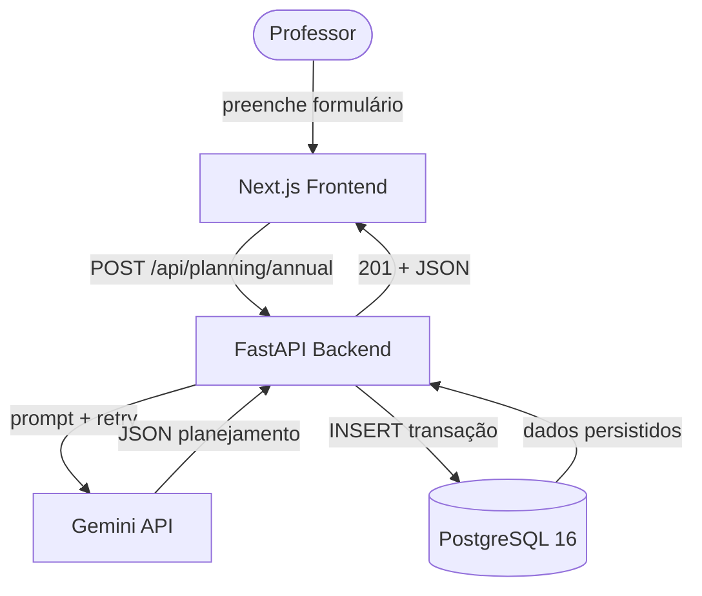
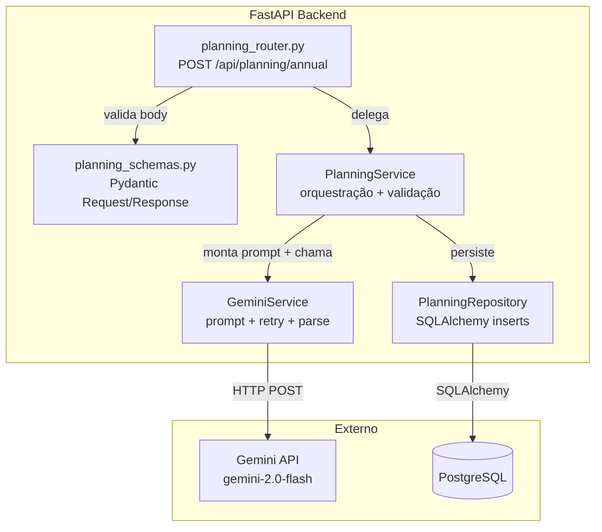
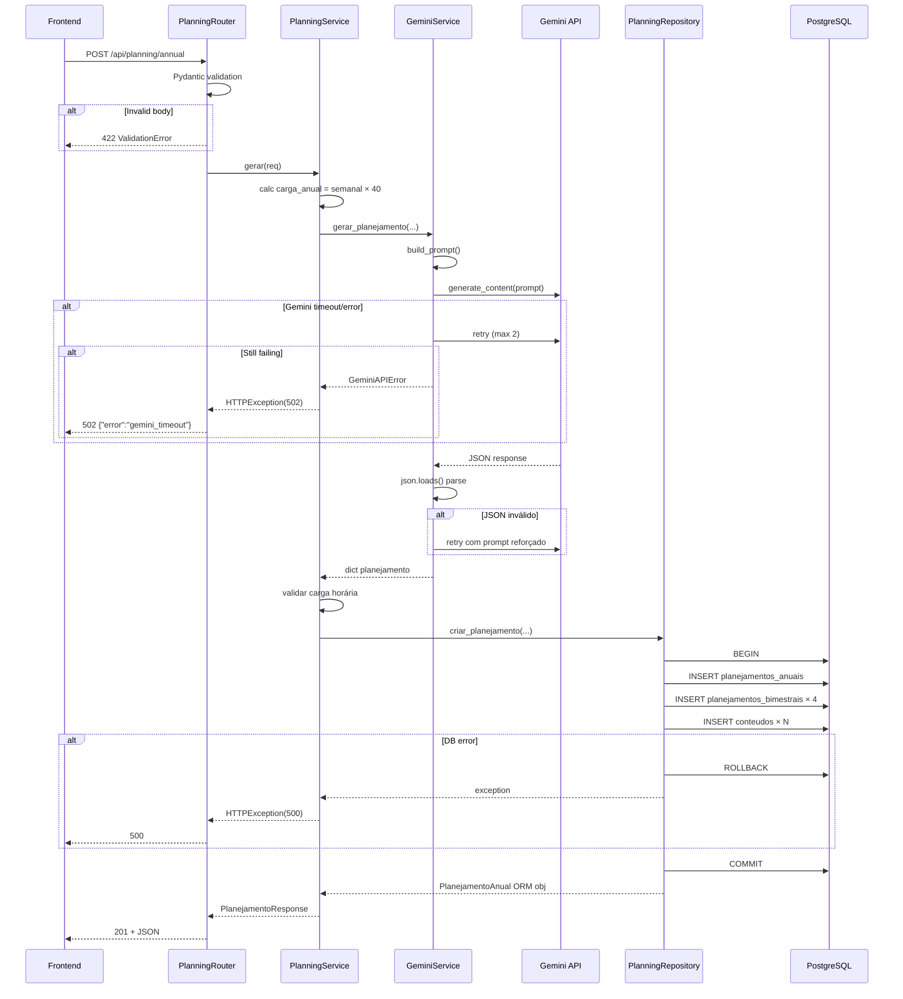

# Architecture: Gerador de Planejamento (RF-001 + RF-002)

**Versão:** 1.0
**Data:** 2026-05-20
**Status:** Aprovada para implementação

---

## 1. Visão Geral

Módulo core do Aula Gamificada. Professor envia disciplina, série, carga horária e temas; sistema chama Gemini API, gera planejamento anual com 4 bimestres, persiste em transação atômica no PostgreSQL. O módulo segue arquitetura em camadas (Router → Service → Repository) dentro do monolito modular FastAPI.

---

## 2. Requisitos Arquiteturais

| Requisito | Tipo | Prioridade | Notas |
|-----------|------|------------|-------|
| POST /api/planning/annual gera planejamento completo | Funcional | Must | RF-001 |
| Persistência atômica (anual + bimestres + conteúdos) | Funcional | Must | RF-001 + RF-002 |
| Integração com Gemini API com retry (máx 2) | Funcional | Must | RF-001 |
| Resposta em < 30s p95 | Não-funcional | Must | Dominado por latência Gemini |
| Transação rollback em qualquer falha de insert | Não-funcional | Must | Integridade referencial |
| Rate limit 10 req/min por professor | Não-funcional | Should | Prevenir abuso |

---

## 3. Estilo Arquitetural

**Monolito modular em camadas** (Router → Service → Repository).

Justificativa: time pequeno, domínio bem definido, sem necessidade de escalar componentes independentemente. Camadas dão separação clara de responsabilidades sem overhead de rede entre serviços.

| Alternativa | Por que não |
|-------------|-------------|
| Microsserviços | Overhead operacional, complexidade de orquestração desnecessária para MVP |
| Serverless (Lambda) | Timeout 30s no Gemini seria limite; cold start piora latência |

---

## 4. Diagrama de Contexto



---

## 5. Diagrama de Componentes Internos



---

## 6. Estrutura de Arquivos

```
backend/app/
├── routers/
│   └── planning.py          # POST /api/planning/annual
├── schemas/
│   └── planning.py          # Request/Response Pydantic models
├── services/
│   ├── planning_service.py  # PlanningService (orquestração)
│   └── gemini_service.py    # GeminiService (IA)
├── repositories/
│   └── planning_repo.py     # PlanningRepository (DB)
├── models/                   # (já existente — 7 ORM models)
├── config.py                 # (já existente)
└── database.py               # (já existente)
```

NOVO: `repositories/` — novo pacote, camada de acesso a dados.

---

## 7. Contratos (Schemas Pydantic)

### 7.1 Request

```python
# schemas/planning.py
from pydantic import BaseModel, Field

class GerarPlanejamentoRequest(BaseModel):
    professor_id: str = Field(..., min_length=1, max_length=255)
    disciplina: str = Field(..., min_length=2, max_length=255)
    serie: str = Field(..., min_length=2, max_length=100)
    carga_horaria_semanal: int = Field(..., ge=1, le=50)
    ano_letivo: int = Field(..., ge=2024, le=2100)
    temas_curriculares: list[str] = Field(default_factory=list, max_length=20)

    model_config = {"json_schema_extra": {
        "example": {
            "professor_id": "prof-123",
            "disciplina": "Língua Portuguesa",
            "serie": "3º Ano Ensino Médio",
            "carga_horaria_semanal": 5,
            "ano_letivo": 2026,
            "temas_curriculares": ["Gramática", "Literatura", "Redação"]
        }
    }}
```

### 7.2 Response (201)

```python
class ConteudoResponse(BaseModel):
    id: UUID
    titulo: str
    descricao: str | None
    tipo: str | None
    carga_horaria_estimada: int

    model_config = {"from_attributes": True}

class BimestreResponse(BaseModel):
    id: UUID
    numero: int
    titulo: str | None
    temas_principais: str | None
    carga_horaria: int
    conteudos: list[ConteudoResponse]

    model_config = {"from_attributes": True}

class PlanejamentoResponse(BaseModel):
    id: UUID
    professor_id: str
    disciplina: str
    serie: str
    carga_horaria_semanal: int
    carga_horaria_anual: int
    ano_letivo: int
    status: str
    carga_warning: bool
    bimestres: list[BimestreResponse]
    created_at: datetime

    model_config = {"from_attributes": True}
```

### 7.3 Erro

```python
class ErrorResponse(BaseModel):
    error: str
    detail: str
    retryable: bool
```

---

## 8. Design Detalhado por Camada

### 8.1 Router — `routers/planning.py`

```python
from fastapi import APIRouter, Depends
from sqlalchemy.orm import Session

router = APIRouter(prefix="/api/planning", tags=["planning"])

@router.post("/annual", status_code=201, response_model=PlanejamentoResponse)
async def gerar_planejamento_anual(
    body: GerarPlanejamentoRequest,
    db: Session = Depends(get_db),
):
    service = PlanningService(db)
    return await service.gerar(body)
```

Responsabilidades:
- Receber request, validar body via Pydantic (automático FastAPI)
- Instanciar PlanningService com sessão DB
- Retornar response 201 ou propagar HTTPException

### 8.2 Service — `services/planning_service.py`

```python
class PlanningService:
    SEMANAS_LETIVAS = 40

    def __init__(self, db: Session):
        self.db = db
        self.gemini = GeminiService()
        self.repo = PlanningRepository(db)

    async def gerar(self, req: GerarPlanejamentoRequest) -> PlanejamentoResponse:
        carga_anual = req.carga_horaria_semanal * self.SEMANAS_LETIVAS

        # 1. Chamar Gemini
        gemini_output = await self.gemini.gerar_planejamento(
            disciplina=req.disciplina,
            serie=req.serie,
            carga_horaria_semanal=req.carga_horaria_semanal,
            carga_horaria_anual=carga_anual,
            ano_letivo=req.ano_letivo,
            temas=req.temas_curriculares,
        )

        # 2. Validar carga horária
        carga_warning = self._validar_carga(gemini_output, carga_anual)

        # 3. Persistir em transação
        planejamento = self.repo.criar_planejamento(
            professor_id=req.professor_id,
            disciplina=req.disciplina,
            serie=req.serie,
            carga_horaria_semanal=req.carga_horaria_semanal,
            carga_horaria_anual=carga_anual,
            ano_letivo=req.ano_letivo,
            gemini_output=gemini_output,
            status="carga_desalinhada" if carga_warning else "ativo",
        )

        # 4. Montar response
        return self._to_response(planejamento, carga_warning)

    def _validar_carga(self, output, carga_esperada):
        soma = sum(b["carga_horaria"] for b in output["bimestres"])
        return abs(soma - carga_esperada) / carga_esperada > 0.05
```

Responsabilidades:
- Orquestrar fluxo completo
- Calcular carga horária anual
- Coordenar chamada IA + persistência
- Validar consistência dos dados
- Montar response DTO

### 8.3 GeminiService — `services/gemini_service.py`

```python
import json
import google.generativeai as genai
from tenacity import retry, stop_after_attempt, wait_exponential

class GeminiService:
    MODEL = "gemini-2.0-flash"
    MAX_RETRIES = 2
    TIMEOUT = 30  # segundos

    def __init__(self):
        genai.configure(api_key=settings.gemini_api_key)
        self.model = genai.GenerativeModel(self.MODEL)

    async def gerar_planejamento(self, **kwargs) -> dict:
        prompt = self._build_prompt(**kwargs)

        for attempt in range(self.MAX_RETRIES):
            try:
                response = await self.model.generate_content_async(
                    prompt,
                    generation_config={"response_mime_type": "application/json"},
                )
                return self._parse_response(response.text)

            except json.JSONDecodeError:
                if attempt == self.MAX_RETRIES - 1:
                    raise GeminiParseError("IA retornou JSON inválido após retries")
                continue

            except Exception as e:
                if attempt == self.MAX_RETRIES - 1:
                    raise GeminiAPIError(f"Falha na API Gemini: {str(e)}")
                continue

    def _build_prompt(self, disciplina, serie, carga_horaria_semanal,
                      carga_horaria_anual, ano_letivo, temas) -> str:
        temas_str = ", ".join(temas) if temas else "Temas curriculares padrão da BNCC"
        return PROMPT_TEMPLATE.format(
            disciplina=disciplina,
            serie=serie,
            carga_horaria_semanal=carga_horaria_semanal,
            carga_horaria_anual=carga_horaria_anual,
            ano_letivo=ano_letivo,
            temas_curriculares=temas_str,
        )

    def _parse_response(self, text: str) -> dict:
        return json.loads(text)
```

Responsabilidades:
- Montar prompt com template da spec
- Chamar Gemini API com timeout 30s
- Retry em falha de parse (máx 2)
- Retornar dict Python válido

### 8.4 Repository — `repositories/planning_repo.py`

```python
class PlanningRepository:
    def __init__(self, db: Session):
        self.db = db

    def criar_planejamento(self, professor_id, disciplina, serie,
                           carga_horaria_semanal, carga_horaria_anual,
                           ano_letivo, gemini_output, status) -> PlanejamentoAnual:
        try:
            planejamento = PlanejamentoAnual(
                professor_id=professor_id,
                disciplina=disciplina,
                serie=serie,
                carga_horaria_semanal=carga_horaria_semanal,
                carga_horaria_anual=carga_horaria_anual,
                ano_letivo=ano_letivo,
                status=status,
            )
            self.db.add(planejamento)
            self.db.flush()  # gera ID

            for bim_data in gemini_output["bimestres"]:
                bim = PlanejamentoBimestral(
                    planejamento_anual_id=planejamento.id,
                    bimestre=bim_data["numero"],
                    titulo=bim_data.get("titulo"),
                    temas_principais=bim_data.get("temas_principais"),
                    carga_horaria=bim_data["carga_horaria"],
                )
                self.db.add(bim)
                self.db.flush()

                for cont_data in bim_data.get("conteudos", []):
                    conteudo = Conteudo(
                        planejamento_bimestral_id=bim.id,
                        titulo=cont_data["titulo"],
                        descricao=cont_data.get("descricao"),
                        tipo=cont_data.get("tipo"),
                        carga_horaria_estimada=cont_data["carga_estimada"],
                    )
                    self.db.add(conteudo)

            self.db.commit()
            self.db.refresh(planejamento)
            return planejamento

        except Exception:
            self.db.rollback()
            raise
```

Responsabilidades:
- Inserir PlanejamentoAnual + PlanejamentoBimestral[] + Conteudo[] em transação
- Rollback em qualquer falha
- Retornar ORM object hidratado com relationships

---

## 9. Fluxo de Dados (Sequence)



---

## 10. Tratamento de Erros

| Camada | Erro | HTTP Status | Retryable |
|--------|------|-------------|-----------|
| FastAPI/Pydantic | Body inválido | 422 | Sim (corrigir input) |
| GeminiService | JSON parse falhou 2x | 502 | Sim |
| GeminiService | Timeout 30s 2x | 502 | Sim |
| GeminiService | Safety filter bloqueou | 502 | Não |
| PlanningRepository | DB connection refused | 500 | Sim |
| PlanningRepository | Constraint violation | 500 | Não |
| Router | Rate limit excedido | 429 | Sim (wait) |

---

## 11. Riscos e Mitigações

| Risco | Prob | Impacto | Mitigação |
|-------|------|---------|-----------|
| Gemini API instável/fora do ar | Média | Alto — feature core indisponível | Retry + fallback para OpenAI (Fase 2) |
| Gemini retorna JSON com estrutura nova | Baixa | Médio — parse falha | Pydantic validation + prompt constraint forte |
| Latência Gemini > 30s | Baixa | Médio — UX ruim | Timeout 30s + retry; considerar streaming (v2) |
| Custo de tokens sobe com planejamentos grandes | Média | Baixo — budget | Cache de planejamentos similares (v2) |

---

## 12. Roadmap de Implementação

**Agora (este turno):**
1. Criar `backend/app/repositories/__init__.py`
2. Criar `backend/app/schemas/planning.py`
3. Criar `backend/app/services/gemini_service.py`
4. Criar `backend/app/services/planning_service.py`
5. Criar `backend/app/repositories/planning_repo.py`
6. Criar `backend/app/routers/planning.py`
7. Registrar router em `main.py`
8. Testar fluxo completo com mock do Gemini
