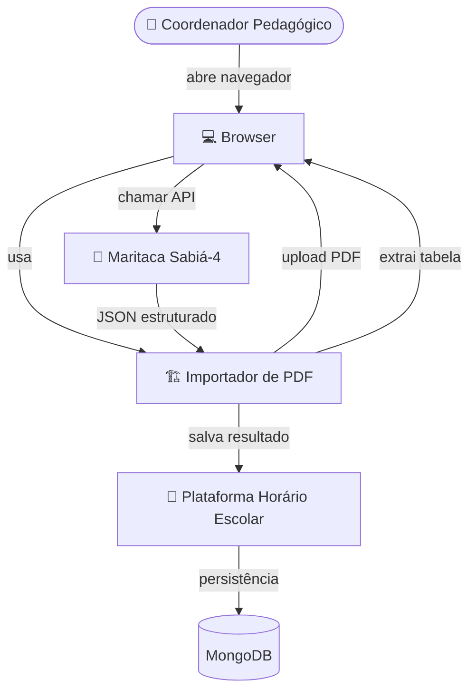
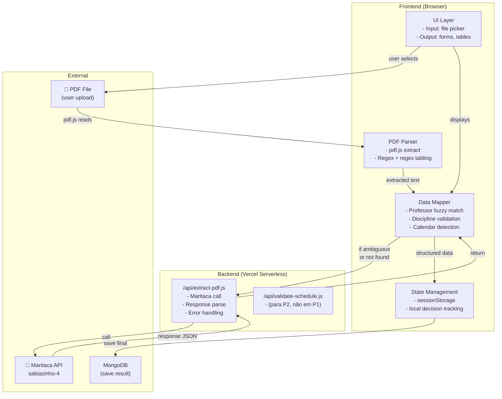
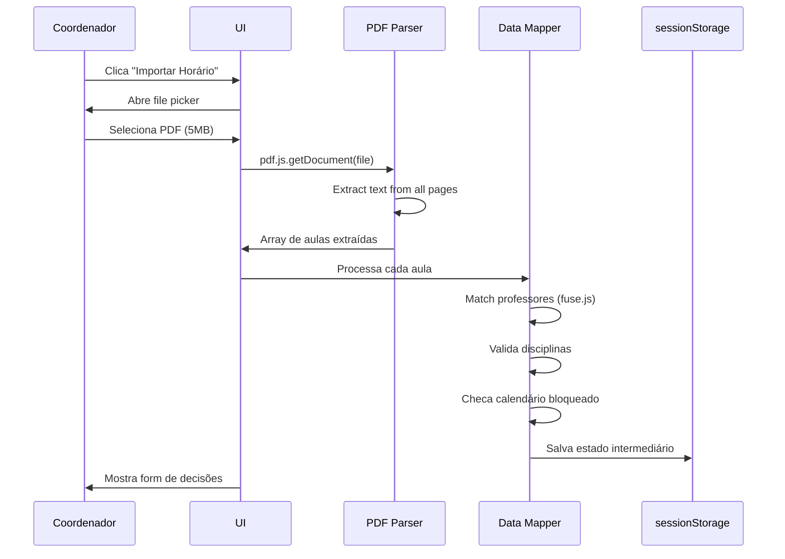
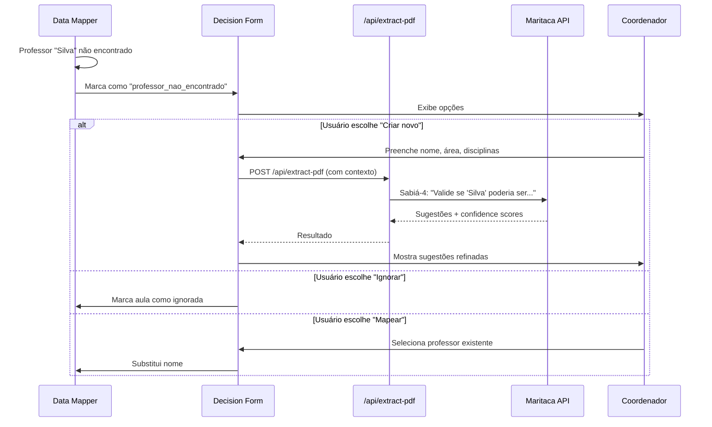

# Architecture — Phase 1 (Parsing + Mapping)
**PDF Import Reorganizer — Horário Escolar**

**Data:** 21 de maio de 2026  
**Versão:** 1.0  
**Escopo:** P1 — Upload, Extração, Mapeamento (RF-01 a RF-05)

---

## 1. Visão Geral

O **Importador de PDF** é um módulo da plataforma Horário Escolar que permite coordenadores pedagógicos fazer upload de arquivos PDF contendo horários antigos e reorganizá-los automaticamente conforme as salas temáticas da escola. 

A **Fase 1 (P1)** entrega especificamente o pipeline de **entrada**: upload do PDF, extração de dados estruturados (turmas, disciplinas, professores, horários), validação (mapeamento de professores, disciplinas, calendário bloqueado) e apresentação de decisões pendentes ao usuário.

A saída do P1 é um objeto JSON estruturado pronto para ser processado pelo algoritmo CSP (P2) ou manualmente editado pelo usuário (P3).

---

## 2. Requisitos Arquiteturais

| Requisito | Tipo | Prioridade | Notas |
|-----------|------|------------|-------|
| Upload até 10 MB | Funcional | Alta | file picker nativo, magic bytes validation |
| Extração de PDF em < 5 seg | Não-funcional | Alta | pdf.js no browser, tolerância a falhas |
| Match fuzzy de professores (85%+) | Funcional | Alta | Levenshtein distance ou similar |
| Offline-first | Não-funcional | Média | Dados processados no browser, localStorage fallback |
| Validação real-time | Funcional | Média | Feedback imediato sem spinner longo |
| Sem armazenamento de PDF | Não-funcional | Alta | Segurança — apenas metadados extraídos |
| Compatível com Chrome/Firefox/Safari | Não-funcional | Média | Desktop first |
| Acesso apenas para usuários logados | Funcional | Alta | Integração com auth existente |

---

## 3. Estilo Arquitetural Recomendado

**Estilo:** Modular frontend-first com Serverless backend opcional

**Por quê:**
- **P1 processa no browser** (pdf.js, regex, fuzzy matching) → zero latência, zero custo Vercel
- **Backend envolvido apenas na chamada à Maritaca** (sabiazinho-4) → Serverless cai bem
- **Simplicidade:** time de 1-2 devs consegue manter sem overhead de orquestração
- **Escalabilidade:** cada cliente processa seu PDF, sem consumir backend resources

**Trade-offs descartados:**
| Opção | Por que não |
|-------|------------|
| Tudo no backend | Latência alta (upload + processamento), custo Maritaca duplicado |
| Tudo no frontend | Não consegue chamar Maritaca sem CORS issue, sem fallback |
| GraphQL | Overhead para um único endpoint; REST é suficiente |

---

## 4. Diagrama de Contexto



---

## 5. Diagrama de Componentes (P1)



---

## 6. Fluxo de Dados (P1)

```
1. Upload (RF-01)
   User clicks "Importar Horário (PDF)"
   → Browser file picker
   → Validate: magic bytes (PDF), size < 10MB
   → Load file into memory

2. Extraction (RF-02)
   pdf.js.getDocument(file)
   → Iterate pages
   → Extract text + try to detect table structure (regex for patterns)
   → Output: Array of "aulas" with fields:
     { turma, disciplina, professor, sala, dia, tempo, carga_semanal }

3. Mapping (RF-03 + RF-04 + RF-05)
   For each aula extracted:
     a) Match professor name → cached list of school's professors
        - If exact match: ✅ mark as "match_found"
        - If fuzzy match (>85%): ✅ mark as "match_found_fuzzy"
        - If no match: ⚠️ mark as "not_found" + suggest alternatives
     
     b) Validate discipline → cached list of school's disciplines + BNCC areas
        - If exists: ✅ mark as "valid"
        - If not exists: ⚠️ mark as "not_found" + ask user for action
     
     c) Check calendar blockers
        - If [dia, tempo] is in blocked_slots: 🚫 mark as "blocked"

4. Decision Collection (RF-06)
   Display form with unresolved items (professors, disciplines, conflicts)
   User decides:
     - Create new professor
     - Map to existing professor
     - Create new discipline in area X
     - Ignore aula
   
   → All decisions cached in sessionStorage

5. Output
   JSON object ready for P2:
   {
     extracted_aulas: [...],
     decisions: { professors_created: [...], disciplines_created: [...], ignored_aulas: [...] },
     metadata: { pdf_name, extraction_time, user_email, school_id }
   }
```

---

## 7. Decisões de Tecnologia (P1)

| Camada | Tecnologia | Motivo |
|--------|-----------|--------|
| **Frontend Framework** | HTML5 + Vanilla JS | Zero dependencies, já é o padrão do projeto |
| **Styling** | Tailwind CSS (CDN) | Já está em uso, rápido para UI |
| **PDF Parsing** | pdf.js (NPM) | Open source, confiável, não requer backend |
| **Fuzzy Match** | fuse.js (NPM) | ~15KB, rápido, Levenshtein built-in |
| **Validation** | JavaScript nativo | Simples, sem lib extra |
| **State** | sessionStorage | Dados temporários, bom para P1 |
| **Backend API** | Vercel Serverless (Node.js) | Já está em uso, cold start aceitável |
| **LLM para OCR** | Maritaca sabiazinho-4 | Custo mínimo, bom para PT-BR |
| **HTTP Client** | fetch nativo | Suportado em todos os browsers modernos |

---

## 8. Estrutura de Pastas (P1)

```
horario-escolar/
├── webapp/
│   ├── index.html                    # App entry
│   ├── css/
│   │   └── import-pdf.css           # Estilos da modal/page de import
│   ├── js/
│   │   ├── modules/
│   │   │   ├── pdf-upload.js         # RF-01: upload + validation
│   │   │   ├── pdf-parser.js         # RF-02: extraction (pdf.js wrapper)
│   │   │   ├── data-mapper.js        # RF-03/04/05: match + validation
│   │   │   ├── decision-form.js      # RF-06: form UI
│   │   │   ├── fuzzy-match.js        # Helper: Levenshtein algo
│   │   │   └── storage-utils.js      # sessionStorage helpers
│   │   └── pages/
│   │       └── import-pdf-page.js    # Main orchestrator
│   ├── api/
│   │   ├── extract-pdf.js            # POST /api/extract-pdf (Maritaca call)
│   │   ├── validate-data.js          # (future) POST /api/validate-schedule
│   │   └── save-grade.js             # (existing) POST /api/save-grade
│   ├── .env.example                  # Add: MARITACA_API_KEY
│   ├── .env.local                    # (local dev)
│   └── package.json
│
└── specs/
    └── architecture-p1.md             # This file
```

---

## 9. Dependências NPM para P1

```json
{
  "dependencies": {
    "pdfjs-dist": "^4.4.168",  // PDF parsing
    "fuse.js": "^7.0.0"        // Fuzzy matching
  },
  "devDependencies": {
    // No build step needed for P1 (vanilla JS)
  }
}
```

**Install:**
```bash
npm install pdfjs-dist fuse.js
```

---

## 10. Variáveis de Ambiente (P1)

### Frontend (.env.local)
```
VITE_MARITACA_API_KEY=sk_test_xxxxx  # (ou similar conforme Maritaca)
VITE_APP_URL=http://localhost:8000
```

### Backend (Vercel)
```
MARITACA_API_KEY=sk_prod_xxxxx       # Production key (encrypted no Vercel)
MONGODB_URI=mongodb+srv://...        # (já existe)
```

### Runtime Detection
```javascript
// Em pdf-upload.js
const maritacaKey = process.env.VITE_MARITACA_API_KEY || process.env.MARITACA_API_KEY;
const useBackend = !!maritacaKey; // If key available, use backend API
```

---

## 11. Fluxos Críticos (Sequence Diagrams)

### 11.1 Upload + Extração (Happy Path)



### 11.2 Match Ambíguo (Professor Não Encontrado)



---

## 12. Deploy e Infraestrutura (P1)

### Ambientes

| Ambiente | Deploy | Maritaca Key | Onde testar |
|----------|--------|-------------|------------|
| **Local (dev)** | `python -m http.server 8000` | test key (sandbox) | localhost:8000 |
| **Staging** | Vercel preview branch | test key | vercel-preview.git... |
| **Production** | Vercel main branch | prod key (encrypted) | horario-escolar.vercel.app |

### CI/CD (minimal para P1)

```yaml
# .github/workflows/deploy-p1.yml
name: Deploy P1 to Vercel

on:
  push:
    branches: [main]
    paths: ['webapp/**']

jobs:
  deploy:
    runs-on: ubuntu-latest
    steps:
      - uses: actions/checkout@v4
      - uses: vercel/actions/build@v5
        with:
          project-id: ${{ secrets.VERCEL_PROJECT_ID }}
          org-id: ${{ secrets.VERCEL_ORG_ID }}
          token: ${{ secrets.VERCEL_TOKEN }}
          environment: production
          env: |
            MARITACA_API_KEY=${{ secrets.MARITACA_API_KEY_PROD }}
            MONGODB_URI=${{ secrets.MONGODB_URI }}
```

---

## 13. Riscos e Mitigações (P1)

| Risco | Probabilidade | Impacto | Mitigação |
|-------|--------------|---------|-----------|
| PDF com layout complexo (imagens, gráficos) | 🟡 Média | 🔴 Alto | Validar extração < 70% → avisar usuário + fallback manual |
| Maritaca API lenta (>5 seg) | 🟢 Baixa | 🟡 Médio | Timeout 10 seg + retry automático; fallback para Sabiá-1 |
| Fuzzy match muito permissivo (false positives) | 🟡 Média | 🟡 Médio | Threshold 85% não 70%; sempre mostrar alternativas ao usuário |
| sessionStorage cheio (dados grandes) | 🟢 Baixa | 🟢 Baixo | Limitar a 5MB; descartar dados antigos |
| CORS block ao chamar Maritaca | 🟢 Baixa | 🟡 Médio | Sempre rotar via `/api/extract-pdf`, não diretamente do browser |
| User fecha aba antes de salvar | 🟢 Baixa | 🟢 Baixo | Mostrar warning "tem dados não salvos" |

---

## 14. Roadmap de Implementação (P1)

### Sprint 1 — Upload + Básico (4-5 dias)

**Objetivo:** Upload funcional, extração básica, primeiros matches

**Tarefas:**
- [ ] Componente file picker (Tailwind modal)
- [ ] Validação (magic bytes, size < 10MB)
- [ ] Integração pdf.js (npm install + test)
- [ ] Parser básico (regex para tabelas simples)
- [ ] Output JSON estruturado (teste com PDF de exemplo)

**Critério de sucesso:**
- Upload + extract em < 5 seg
- JSON com 90%+ das aulas extraídas corretamente
- Sem erros no console

**Esforço:** ~10-12 horas/pessoa

---

### Sprint 2 — Mapping + Decisões (3-4 dias)

**Objetivo:** Match de professores, validação de disciplinas, form de decisões

**Tarefas:**
- [ ] Integração fuse.js (fuzzy matching)
- [ ] Cache de professores/disciplinas da escola
- [ ] Lógica de match + status badges
- [ ] Form de decisões (criar, mapear, ignorar)
- [ ] sessionStorage persist

**Critério de sucesso:**
- Fuzzy match encontra 85%+ de professores reais
- Form renderiza corretamente com 50+ items
- Decisões são persistidas em sessionStorage

**Esforço:** ~10-12 horas/pessoa

---

### Sprint 3 — Maritaca + Refinamento (2-3 dias)

**Objetivo:** Integração com Maritaca, fallback, testes end-to-end

**Tarefas:**
- [ ] Serverless `/api/extract-pdf.js` (Maritaca call)
- [ ] Tratamento de erros (timeout, invalid API key)
- [ ] Fallback cascade (S-4 → S-1 → manual)
- [ ] Testes com 5+ PDFs reais
- [ ] Otimizações de performance

**Critério de sucesso:**
- API call bem-sucedido em < 5 seg (95% das vezes)
- Fallback automático se S-4 falhar
- Zero erros em navegadores Chrome/Firefox/Safari

**Esforço:** ~8-10 horas/pessoa

---

### Total P1: ~3 semanas (1 pessoa em tempo parcial, ou 2 pessoas 1.5 semanas)

---

## 15. API Contracts (P1)

### POST /api/extract-pdf

**Request:**
```javascript
{
  pdf_text: "texto extraído do PDF...",  // string (já extraído no browser)
  school_id: "escola_123",                // string
  user_email: "coord@school.edu.br"       // string
}
```

**Response (200 OK):**
```javascript
{
  success: true,
  structured_data: {
    aulas: [
      {
        turma: "1A",
        disciplina: "Português",
        professor: "Ana Silva",
        sala: "Sala 101",
        dia: "segunda",
        tempo: "1",
        carga_semanal: 5,
        confidence: 0.95  // Maritaca confidence score
      }
    ],
    extracted_at: "2026-05-21T10:35:00Z"
  }
}
```

**Response (400 Bad Request):**
```javascript
{
  success: false,
  error: "PDF text too corrupted or unreadable",
  message: "Não conseguimos extrair a tabela. Dica: verifique se é uma tabela clara sem imagens."
}
```

### GET /api/school/:school_id/professors

**(Reutilizar endpoint existente da plataforma)**

Retorna lista de professores cadastrados:
```javascript
{
  professors: [
    { id: "prof_001", name: "Ana Silva", area: "Linguagens" },
    { id: "prof_002", name: "João da Silva", area: "Matemática" },
    ...
  ]
}
```

### GET /api/school/:school_id/disciplines

**(Reutilizar ou criar)**

Retorna disciplinas + áreas BNCC:
```javascript
{
  disciplines: [
    { id: "disc_001", name: "Português", area: "Linguagens" },
    { id: "disc_002", name: "Matemática", area: "Matemática" },
    ...
  ],
  areas: ["Linguagens", "Matemática", "Ciências da Natureza", "Ciências Humanas", "Itinerários"]
}
```

---

## 16. Testes (P1)

### Unit Tests (opcional para MVP, mas recomendado)

```bash
# Test file: js/modules/__tests__/pdf-parser.test.js
npm test

# Cases:
# - pdf.js extract valid PDF → returns aulas array
# - pdf.js invalid PDF → returns error
# - fuzzy match "Ana Silvaaa" → matches "Ana Silva" (>85%)
# - fuzzy match "XYZ Professor" → no match
# - calendar blockers respected → correct slots marked as blocked
```

### E2E Scenario (Manual + Browser Console)

```javascript
// 1. Open DevTools > Console
// 2. Paste test code
console.log("Testing PDF Import P1...");

const testPDF = new File(["test"], "sample.pdf", { type: "application/pdf" });
const result = await window.pdfParser.extract(testPDF);

console.assert(result.aulas.length > 0, "Should extract aulas");
console.assert(result.aulas[0].turma !== undefined, "Should have turma");
console.log("✅ P1 tests passed");
```

---

## 17. Gaps Ainda Não Definidos (P1)

| Gap | Impacto | Ação |
|-----|---------|------|
| Exato format de tabela esperado no PDF | Alto | Testar com 5+ PDFs reais da escola; ajustar regex conforme necessário |
| Estratégia de fallback se Maritaca falhar | Médio | Decidir: retornar JSON parcial? Pedir retry? Limpar em produção? |
| Integração com auth existente (JWT) | Alto | Garantir que `/api/extract-pdf` valida token do usuário |
| Limite de tamanho para sessionStorage | Baixo | Testar com horários de 50+ turmas; 5MB deve ser suficiente |
| UX de "aula não alocada" em P1 vs. P2 | Médio | P1 apenas detecta; P2 tenta alocar. P1 não deve prometer resolver. |

---

## 18. Como Iniciar P1

```bash
# 1. Clone/pull
git clone https://github.com/Kelso-Palheta/horario-escolar.git
cd horario-escolar/webapp

# 2. Instalar deps
npm install pdfjs-dist fuse.js

# 3. Copiar .env
cp .env.example .env.local
# Editar .env.local com chave Maritaca (sandbox)

# 4. Rodar local
python -m http.server 8000
# Abrir http://localhost:8000

# 5. Testar import
# - Clique "Importar Horário (PDF)"
# - Selecione arquivo PDF de teste
# - Veja extração no console
```

---

## 19. Links Úteis

- **Spec Completa:** `specs/pdf-import-reorganizer-spec.md`
- **Maritaca Docs:** https://maritaca.ai/ (sabiazinho-4 model card)
- **pdf.js Docs:** https://mozilla.github.io/pdf.js/
- **fuse.js Docs:** https://fusejs.io/

---

**Próximas Etapas:**
1. ✅ Arquitetura P1 definida
2. ⏭️ Iniciar Sprint 1 (Upload + básico)
3. ⏭️ Criar ticket/tasks no GitHub/Jira
4. ⏭️ Setup Vercel secrets (MARITACA_API_KEY)
