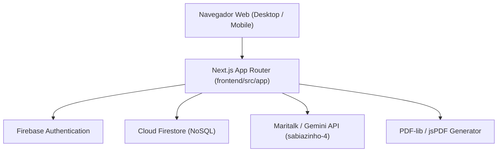

# 🏗️ Arquitetura do Sistema — SimuladoApp.Edu

## 1. Topologia da Aplicação

---

## 2. Camadas da Aplicação (`frontend/src/`)

- **`app/` (Apresentação & Rotas):**
  - Rotas principais (`/`, `/diario`, `/calendario`, `/redacao`, `/aluno`, `/atividades`).
  - Layouts raiz com injeção de fontes (`Manrope` e `Inter`) e tokens globais.
- **`components/` (Componentes Visuais Modulares):**
  - `landing/`: Landing page de vendas e AuthModal.
  - `diario/`: TabelaNotas, Sidebar, ImportModal, ProfileModal.
  - `calendario/`: CalendarioView, Sidebar, CardAula, Modais.
  - `atividades/`: Formulários e renderizadores de questões.
- **`hooks/` (Lógica de Estado e Orquestração):**
  - `useTurmas`, `useNotas`, `useCalendarioPedagogico`.
- **`lib/` (Infraestrutura & Clientes Externos):**
  - `firebase.js`, `auth-context.js`, `maritalk.js`, geradores de PDF.
- **`utils/` (Regras de Domínio Puras & Cálculos):**
  - `calculos.js` (arredondamento, médias, soma máxima).
  - `pdfExtractor.js`, `docxExtractor.js`.

---

## 3. Padrões de Projeto Adotados
- **Optimistic UI:** Atualizações imediatas na interface com persistência assíncrona em Firestore e `localStorage`.
- **Strategy Pattern para Extração de Documentos:** Suporte polimórfico a PDF, DOCX e TXT.
- **Pure Domain Functions:** Cálculos de notas isolados de dependências de interface para garantir 100% de testabilidade.
